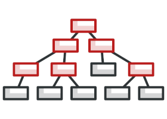

 Composite in Go

**Composite** is a structural design pattern that lets you compose objects into tree structures and then work with these structures as if they were individual objects.

Composite became a pretty popular solution for the most problems that require building a tree structure. Composite’s great feature is the ability to run methods recursively over the whole tree structure and sum up the results.

**Conceptual Example**
Let’s try to understand the Composite pattern with an example of an operating system’s file system. In the file system, there are two types of objects: files and folders. There are cases when files and folders should be treated to be the same way. This is where the Composite pattern comes in handy.

Imagine that you need to run a search for a particular keyword in your file system. This search operation applies to both files and folders. For a file, it will just look into the contents of the file; for a folder, it will go through all files of that folder to find that keyword.
