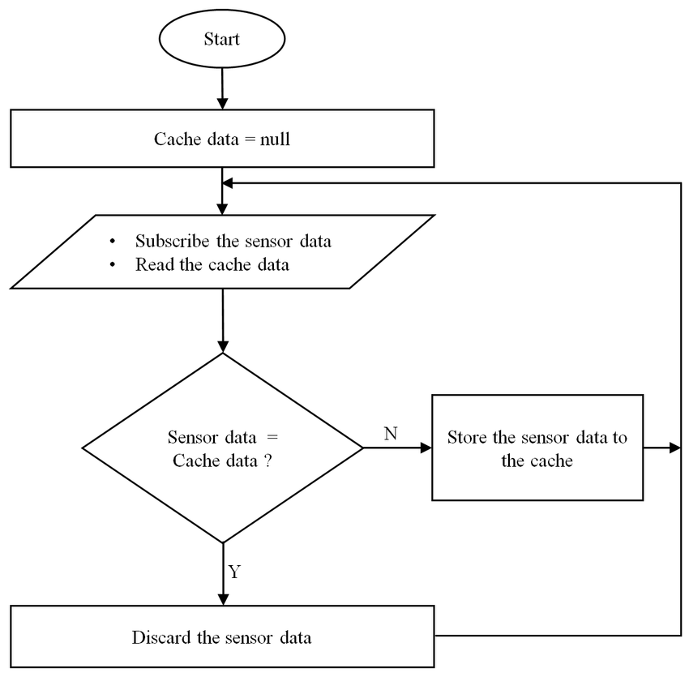

1. Which factors are considered when choosing a garbage collection algorithm?

- GC throughput
- Heap overhead
- Pause times
- Pause frequency
- Pause distribution
- Allocation performance
- Compaction
- Concurrency
- Scaling
- Tuning
- Warm-up time
- Page release
- Portability
- Compatibility

2. In which reference counting algorithm are program-variable references ignored?

**- Deferred reference counting**

- Deferred reference counting is a procedure in which references from different objects to a given objects are checked and program-variable references are overlooked.
- If the tally of the references is zero, that object will not be considered.
- This algorithm helps reduce the overhead of keeping counts up to date.

3. What is the type of reference counting algorithm in which a single-bit flag is used for counting?

**- One-bit reference counting**

- The One-bit reference counting technique utilizes a solitary bit flag to show where an object has one or more references.

- The flag is stored as part of the object pointer. There is no requirement to spare any object for extra space in this technique
- This technique is viable
  since the majority of objects have a reference count of 1.

4. In which reference counting algorithm is a weight assigned to each reference?

**- Weighted reference counting**

- The Weighted reference counting technique tallies the number of references to an object, and each reference is delegated a weight.

- This technique tracks the total weight of the references to an object.

5. Who invented weighted reference counting?

- Bevan, Watson, and
  Watson in 1987

6. Which garbage collection algorithm was proposed by Dijkstra?

- The mark-and-sweep algorithm

7. What class handles concurrency when the mark-and-sweep collector is running?

- A mutator in this algorithm handles concurrency by changing the pointers while the collector is running.
- It also takes care of the condition so that no black object points to a white object.

8. What are the criteria for promoting objects to older generations?

- The algorithm promotes objects to older generations based on the age of the object in the
  garbage collection cycle.

9. Draw a flow chart for the cache management algorithm.
   

10. How do you get indirect memory access outside a method's stack frame?

- You can achieve indirect memory access outside a method's stack frame primarily through the use of pointers, closures, and heap-allocated data.

* Using Pointers for Heap-Allocated Data

```go
func createInt() *int {
  num := new(int)  // Allocates memory on the heap
  *num = 42
  return num       // Returns pointer to heap-allocated memory
}

func main() {
    ptr := createInt()
    fmt.Println(*ptr) // Accesses memory outside the stack frame of `createInt`
}
```

- Passing Pointers to Modify Variables in Other Frames.

```go
func modifyValue(ptr *int) {
    *ptr = 100 // Modifies variable indirectly through the pointer
}

func main() {
    value := 50
    modifyValue(&value) // Pass address of `value` to another function
    fmt.Println(value)   // Outputs: 100
}

```

- Using Closures to Capture Variables by Reference

```go
func createCounter() func() int {
    counter := 0
    return func() int {
        counter++   // `counter` is captured by reference
        return counter
    }
}

func main() {
    counterFunc := createCounter()
    fmt.Println(counterFunc()) // Outputs: 1
    fmt.Println(counterFunc()) // Outputs: 2
}

```

- Structs with Pointers to External Data

```go
type DataHolder struct {
    data *int
}

func createDataHolder(value int) DataHolder {
    return DataHolder{data: &value} // Holds a pointer to `value` outside function scope
}

func main() {
    value := 42
    holder := createDataHolder(value)
    fmt.Println(*holder.data) // Indirectly accesses `value` from outside its original scope
}

```

- Using Slices and Maps for Dynamic Memory Allocation

```go
func modifySlice(s []int) {
    s[0] = 100 // Modifies the underlying array
}

func main() {
    slice := []int{1, 2, 3}
    modifySlice(slice)
    fmt.Println(slice) // Outputs: [100, 2, 3], demonstrating indirect access
}
```
